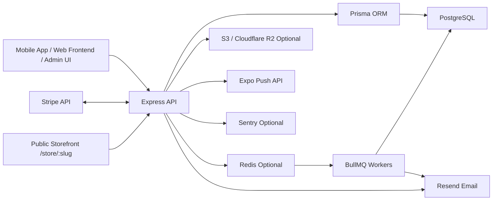
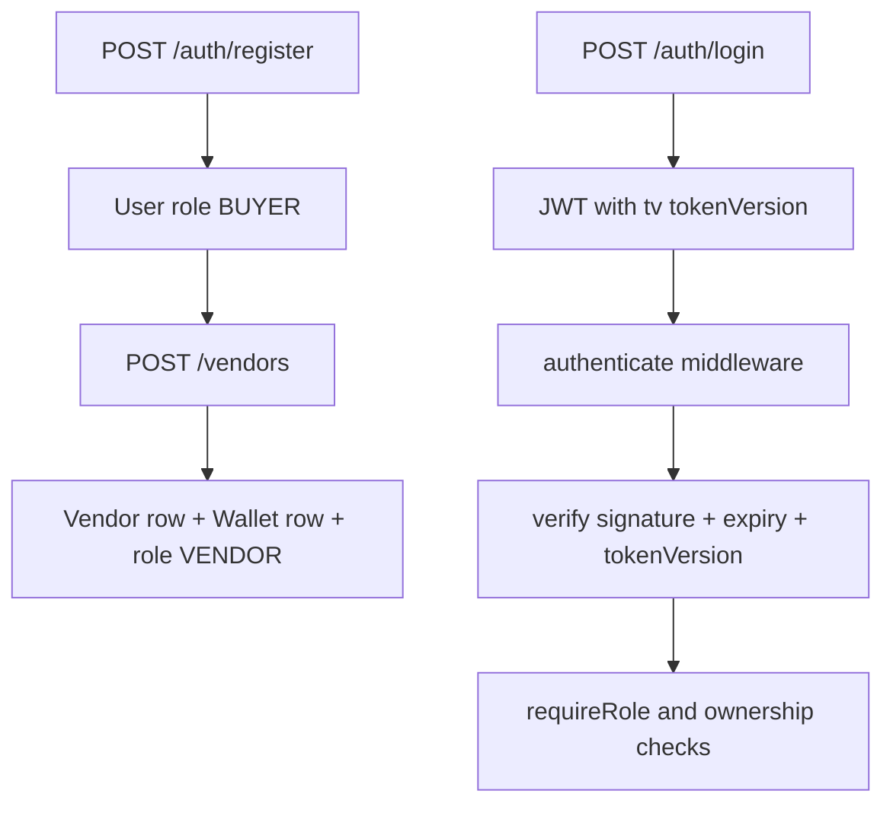
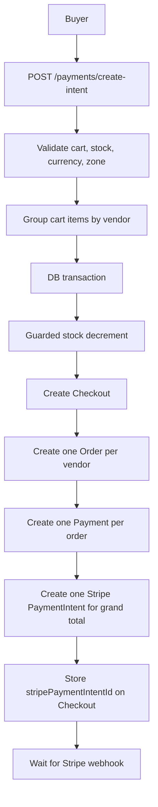
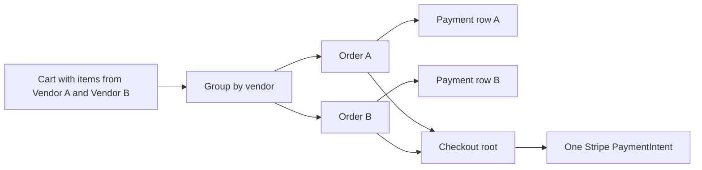
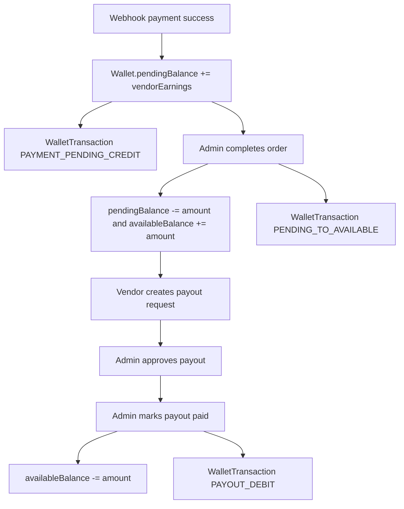
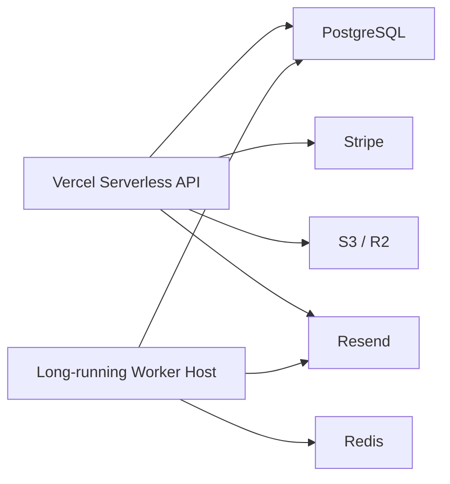

# Backend Architecture

Generated from code inspection of the backend in this repository on 2026-05-15.

## 1. Executive Summary

This codebase is a modular Express + TypeScript marketplace backend centered around Prisma/PostgreSQL and Stripe. The current implementation is broader than the original payment task: it includes JWT auth, buyer and vendor roles, admin operations, multi-vendor cart and checkout, Stripe webhooks, internal vendor wallet ledgering, manual payout workflows, messaging, notifications, uploads, public storefronts, subscriptions, delivery zones, buyer wallets, promo codes, referrals, shipments, verification, audit logs, and optional background workers.

The payment architecture is platform-charge based, not Stripe Connect charge-splitting. Buyer checkout creates one Stripe `PaymentIntent` per `Checkout`, then Stripe webhooks split the result into one paid `Order` and one vendor wallet credit per vendor group. Vendor money movement is modeled internally using `Wallet`, `WalletTransaction`, `PayoutRequest`, and admin-controlled release/debit steps.

Important implementation realities:

- Multi-vendor checkout is implemented.
- Stripe Connect onboarding/status exists, but Connect webhook wiring is not implemented in the HTTP webhook handler.
- Subscription checkout exists, but subscription webhook routing is not implemented.
- Buyer wallet top-up is currently a direct balance credit, not a Stripe-backed flow.
- Queue-backed workers are implemented but only run in a long-lived Node process, not in Vercel serverless.
- Some repository docs and OpenAPI descriptions are stale and do not fully match the live code.

## 2. Tech Stack

- Runtime: Node.js
- Framework: Express 4
- Language: TypeScript 5
- ORM: Prisma 6
- Database: PostgreSQL
- Payments: Stripe SDK
- Auth: JWT with `jsonwebtoken`
- Password hashing: `bcryptjs`
- Security middleware: `helmet`, `cors`, custom request limits, custom rate limiting
- Email: Resend
- Background jobs: BullMQ + Redis
- Push notifications: Expo Push API
- Observability: optional Sentry
- Deployment target in repo: Vercel serverless for API, with separate long-running worker requirement
- Testing: Vitest

## 3. Folder-by-Folder Explanation

### Top level

- `api/index.ts`
  - Vercel entrypoint exporting the Express app.
- `prisma/`
  - Schema, migrations, and seed script.
- `src/`
  - Main application source.
- `vercel.json`
  - Serverless deployment config targeting `src/app.ts`.
- `vitest.config.ts`
  - Test runner setup.
- `.env.example`
  - Environment template.
- `.env.production`
  - Vercel-generated production env placeholder file.
- `README.md`, `DEPLOYMENT_CHECKLIST.md`, `FRONTEND_INTEGRATION.md`
  - Supporting docs. Useful, but not fully authoritative relative to code.

### `src/`

- `app.ts`
  - Express composition root.
- `server.ts`
  - Local/Node server bootstrap, admin bootstrap, worker startup, graceful shutdown.
- `config/`
  - Environment loading and validation.
- `lib/`
  - Shared infrastructure clients and adapters.
- `middlewares/`
  - Auth, rate limiting, logging, request IDs, input limits, error handling.
- `modules/`
  - Feature modules with route/controller/service structure.
- `queues/`
  - BullMQ queue declarations.
- `routes/`
  - API router aggregation.
- `shared/`
  - Pricing helpers, app errors, async wrapper, audit helper, slug helper.
- `tests/`
  - Vitest coverage files.
- `workers/`
  - Background worker processes for email, notifications, stock alerts, stale order cleanup.

### `src/lib/`

- `prisma.ts`
  - Prisma singleton using `globalThis` reuse.
- `stripe.ts`
  - Stripe client.
- `redis.ts`
  - Optional Redis connection.
- `email.ts`, `email-queue.ts`, `email-templates.ts`
  - Resend integration, queue fallback, reusable email templates.
- `expo-push.ts`, `push-notifications.ts`
  - Expo push delivery and event helpers.
- `storage.ts`
  - S3/R2 presigned upload URL support.
- `logger.ts`
  - Structured JSON logger.
- `sentry.ts`
  - Optional Sentry initialization.
- `swagger.ts`
  - Centralized OpenAPI document. It is partially stale relative to the live implementation.

### `src/middlewares/`

- `authenticate.ts`
  - Bearer JWT auth and role enforcement.
- `rate-limit.ts`
  - In-memory IP-based throttling.
- `request-id.ts`
  - Correlation IDs.
- `request-logger.ts`
  - Structured request logs.
- `validate-input-length.ts`
  - Defensive limits on string size, nesting, array size, and field count.
- `not-found.ts`, `error-handler.ts`
  - Centralized 404 and error responses.

### `src/modules/`

- `auth`
  - Registration, login, current user, profile update, password reset, token revocation, account lockout.
- `vendors`
  - Vendor profile creation and updates, payout methods, dashboard, earnings, Stripe Connect onboarding/status/refresh.
- `verification`
  - Vendor document submission and admin review.
- `products`
  - Product CRUD for vendors and public listing for buyers.
- `cart`
  - Buyer cart with multi-vendor item support.
- `delivery`
  - Delivery zones/methods management and delivery quoting.
- `payments`
  - Multi-vendor checkout creation and Stripe PaymentIntent creation.
- `stripe`
  - Stripe webhook processing.
- `orders`
  - Buyer order views and vendor order lifecycle transitions.
- `payouts`
  - Vendor payout requests and admin approval/payment flow.
- `notifications`
  - In-app notification storage and listing.
- `messages`
  - Conversation and message APIs.
- `buyer-wallet`
  - Buyer wallet balance, transactions, top-up, and order debit.
- `promos`
  - Promo validation plus admin promo CRUD via admin routes.
- `referrals`
  - Referral code generation and stats.
- `shipments`
  - Shipment creation/update and buyer/vendor tracking.
- `uploads`
  - Presigned upload URL issuance.
- `public-stores`
  - Public API and server-rendered storefront page.
- `subscriptions`
  - Vendor plan listing, checkout session creation, cancellation, plan limits lookup.
- `push-tokens`
  - Expo push token registration/removal.
- `addresses`
  - Buyer saved addresses.
- `admin`
  - Admin dashboard, analytics, audit logs, moderation, delivery zones, payout actions, order completion.
- `health`
  - Basic and detailed health endpoints.

## 4. System Architecture Diagram

## 5. Request Lifecycle

1. Incoming request enters `src/app.ts`.
2. `trust proxy` is enabled so `req.ip` reflects the upstream proxy.
3. `helmet` runs for most routes, except `/api/docs` and `/store/:slug`.
4. `requestIdMiddleware` attaches or propagates `X-Request-ID`.
5. `cors` applies fail-closed behavior in production when `CORS_ORIGINS` is not set.
6. `requestLogger` logs request metadata.
7. `express.raw()` is applied only to `/api/stripe/webhook`.
8. `express.json()` and `express.urlencoded()` parse normal request bodies.
9. `generalRateLimiter` is applied to `/api`.
10. `validateInputLength` rejects pathological payload sizes and nesting.
11. Module router runs route-specific auth, role checks, validation, controller, then service logic.
12. Service logic uses Prisma and shared infrastructure.
13. `AppError` and unexpected exceptions are normalized by `errorHandler`.

## 6. Auth + RBAC Flow

### Authentication

- `POST /api/auth/register`
  - Creates a `User` with role `BUYER`.
  - Hashes password with `bcryptjs`.
  - Sends welcome email asynchronously.
- `POST /api/auth/login`
  - Looks up user by normalized lowercase email.
  - Enforces lockout after 5 failed attempts for 15 minutes.
  - Returns JWT signed with HS256.
- JWT payload contains:
  - `sub`
  - `role`
  - `email`
  - `tv` which mirrors `User.tokenVersion`
- `authenticate` middleware:
  - Requires `Authorization: Bearer <token>`.
  - Verifies signature and expiry.
  - Reloads the user token version from DB through `authService.verifyTokenVersion`.
  - Rejects revoked tokens when `tv` no longer matches `User.tokenVersion`.

### Role model

- `BUYER`
- `VENDOR`
- `ADMIN`

### Promotion and authorization

- Registration always creates `BUYER`.
- `POST /api/vendors` promotes a buyer into `VENDOR` by creating a `Vendor` plus `Wallet`, then updating the user role.
- `requireRole(...roles)` is used per-route.
- Vendor order access is also constrained by data ownership checks on `OrderItem.vendorId`.
- Admin actions require `ADMIN`.

### Mermaid

## 7. Database Schema Summary

The Prisma schema models money in integer cents throughout.

### Identity and access

- `User`
  - Email/password, role, tokenVersion, failed login counters, lockout fields, referral code fields.
- `PasswordResetToken`
  - One-time reset tokens with expiry and usage tracking.
- `AuditLog`
  - Admin action ledger with actor, action, entity, and metadata.

### Vendor domain

- `Vendor`
  - Store profile, contact fields, public slug, verification status, suspension fields, Stripe Connect status fields.
- `VerificationDocument`
  - Admin-reviewed KYC-style vendor documents.
- `PayoutMethod`
  - Vendor payout destination details.
- `VendorSubscription`
  - Vendor plan state and Stripe customer/subscription ids.

### Catalog and delivery

- `Product`
  - Vendor-owned item, stock, images, pricing, weight, activity flag.
- `DeliveryZone`
  - Global or vendor-specific delivery pricing zones.
- `DeliveryMethod`
  - Methods under a delivery zone.

### Cart and checkout

- `Cart`
  - One cart per buyer.
- `CartItem`
  - Product selections with quantity.
- `Checkout`
  - Multi-vendor checkout root, one Stripe PaymentIntent id, one grand total, one buyer.
- `Order`
  - One order per vendor group under a checkout.
- `OrderItem`
  - Snapshot of items inside an order.
- `Payment`
  - One payment row per order, even though checkout uses one Stripe PaymentIntent.

### Vendor wallet and payouts

- `Wallet`
  - One per vendor, with `pendingBalance` and `availableBalance`.
- `WalletTransaction`
  - Vendor ledger.
  - Uniques:
    - `[vendorId, orderId, paymentId, type]`
    - `[payoutRequestId, type]`
- `PayoutRequest`
  - Vendor withdrawal request.

### Buyer wallet and incentives

- `BuyerWallet`
  - Buyer balance.
- `BuyerWalletTransaction`
  - Buyer wallet ledger.
- `PromoCode`, `PromoRedemption`
- `Referral`

### Communication and fulfillment

- `Conversation`, `Message`
- `Notification`
- `PushToken`
- `Shipment`
- `BuyerAddress`

### Stripe and webhook support

- `WebhookEvent`
  - Stripe event idempotency tracking.

### Migration history summary

Migrations show staged evolution from the original payment foundation into a richer marketplace backend:

- initial schema and payment fields
- webhook events
- indexes
- orders/users reset
- messaging, verification, addresses
- delivery, shipments, dashboard
- admin dashboard and audit
- buyer wallet, promos, referrals
- subscriptions and security
- production Stripe Connect
- multi-vendor cart checkout
- push tokens
- token version and account lockout
- vendor storefront slug

## 8. API Endpoint Map Grouped by Module

All API routes are mounted under `/api`.

### Health

- `GET /health`
- `GET /health/detailed`

### Auth

- `POST /auth/register`
- `POST /auth/login`
- `GET /auth/me`
- `PATCH /auth/me`
- `POST /auth/forgot-password`
- `POST /auth/reset-password`

### Vendors

- `POST /vendors`
- `GET /vendors/me`
- `PATCH /vendors/me`
- `GET /vendors/me/dashboard`
- `GET /vendors/me/earnings`
- `POST /vendors/me/payout-methods`
- `GET /vendors/me/payout-methods`
- `POST /vendors/me/stripe-connect/onboard`
- `GET /vendors/me/stripe-connect/status`
- `POST /vendors/me/stripe-connect/refresh`
- `POST /vendors/me/verification`
- `GET /vendors/me/verification`
- `GET /vendors/me/orders`
- `GET /vendors/me/orders/:id`
- `PATCH /vendors/me/orders/:id/status`

### Public stores

- `GET /public/stores/:slug`
- `GET /public/stores/:slug/products`
- `GET /store/:slug`

### Products

- `GET /products`
- `GET /products/:id`
- `POST /products`
- `PATCH /products/:id`
- `DELETE /products/:id`

### Cart

- `GET /cart`
- `POST /cart/items`
- `PATCH /cart/items/:id`
- `DELETE /cart/items/:id`
- `DELETE /cart`

### Delivery

- `GET /delivery/zones`
- `POST /delivery/calculate`
- `GET /delivery/zones/me`
- `POST /delivery/zones/me`
- `PATCH /delivery/zones/me/:id`
- `DELETE /delivery/zones/me/:id`
- `POST /delivery/zones/me/:zoneId/methods`
- `PATCH /delivery/methods/:id`
- `DELETE /delivery/methods/:id`

### Orders

- `GET /orders/me`
- `GET /orders/:id`

### Payments

- `POST /payments/create-intent`

### Stripe

- `POST /stripe/webhook`

### Payout requests

- `POST /payout-requests`
- `GET /payout-requests/me`

### Notifications

- `GET /notifications`
- `PATCH /notifications/:id/read`

### Conversations / messages

- `GET /conversations`
- `POST /conversations`
- `GET /conversations/:id/messages`
- `POST /conversations/:id/messages`
- `PATCH /conversations/:id/read`

### Addresses

- `GET /addresses`
- `POST /addresses`
- `PATCH /addresses/:id`
- `DELETE /addresses/:id`

### Uploads

- `POST /uploads/request-url`

### Shipments

- `GET /shipments`
- `POST /shipments/orders/:orderId`
- `PATCH /shipments/:id`
- `GET /shipments/orders/:orderId`

### Buyer wallet

- `GET /wallet/me`
- `GET /wallet/me/transactions`
- `POST /wallet/me/top-up`
- `POST /wallet/me/apply`

### Promo codes

- `POST /promo-codes/validate`

### Referrals

- `GET /referrals/me`

### Subscriptions

- `GET /subscriptions/plans`
- `GET /subscriptions/me`
- `GET /subscriptions/me/limits`
- `POST /subscriptions/checkout`
- `POST /subscriptions/cancel`

### Push tokens

- `POST /push-tokens`
- `DELETE /push-tokens/:token`

### Admin

- `GET /admin/dashboard`
- `GET /admin/analytics`
- `GET /admin/audit-logs`
- `GET /admin/users`
- `GET /admin/vendors`
- `GET /admin/products`
- `GET /admin/orders`
- `GET /admin/payments`
- `GET /admin/wallet-transactions`
- `PATCH /admin/vendors/:id/approve`
- `PATCH /admin/vendors/:id/reject`
- `PATCH /admin/vendors/:id/suspend`
- `PATCH /admin/vendors/:id/unsuspend`
- `PATCH /admin/products/:id/approve`
- `PATCH /admin/products/:id/disable`
- `PATCH /admin/orders/:id/complete`
- `GET /admin/payout-requests`
- `PATCH /admin/payout-requests/:id/approve`
- `PATCH /admin/payout-requests/:id/reject`
- `PATCH /admin/payout-requests/:id/mark-paid`
- `GET /admin/verification-documents`
- `PATCH /admin/verification-documents/:id/review`
- `GET /admin/delivery-zones`
- `POST /admin/delivery-zones`
- `PATCH /admin/delivery-zones/:id`
- `DELETE /admin/delivery-zones/:id`
- `GET /admin/promo-codes`
- `POST /admin/promo-codes`
- `PATCH /admin/promo-codes/:id`

## 9. Payment / Order / Wallet Flow

The implemented checkout path is cart-based and multi-vendor.

1. Buyer builds cart.
2. Buyer requests `POST /api/payments/create-intent` with `cartId` and one `destinationZoneId`.
3. Service validates:
   - cart ownership
   - non-empty cart
   - all products active
   - sufficient stock
   - uniform product currency
   - active delivery zone with matching currency
4. Cart items are grouped by `vendorId`.
5. For each vendor group:
   - subtotal is calculated
   - delivery fee is calculated using the same destination zone
   - platform fee is calculated from subtotal only
   - vendor earnings are `subtotal - platformFee`
6. In one DB transaction:
   - all product stocks are atomically decremented using `updateMany` with `stock >= quantity`
   - `Checkout` is created
   - one `Order` per vendor is created
   - `OrderItem` rows are created
   - one `Payment` row per order is created
7. Outside the transaction:
   - one Stripe `PaymentIntent` is created for the `Checkout` grand total
   - metadata stores `checkoutId`, `buyerId`, comma-separated `orderIds`, comma-separated `vendorIds`
8. `Checkout.stripePaymentIntentId` is updated.
9. Only the webhook marks orders paid and credits wallets.

### Mermaid

## 10. Multi-Vendor Checkout Flow

Multi-vendor checkout is implemented in both schema and service code.

### Actual behavior

- Cart accepts items from multiple vendors.
- `Cart` does not store a single `vendorId`.
- Checkout splits the cart into vendor groups.
- The system creates:
  - one `Checkout`
  - many `Order`
  - many `Payment`
  - one Stripe `PaymentIntent`

### Consequences

- Buyer sees multiple orders tied together by `checkoutId`.
- Each vendor sees only orders containing their own items.
- Wallet credits happen per order, not per checkout.

### Important current constraint

- One `destinationZoneId` is passed for the whole checkout.
- That one zone is used to calculate delivery for every vendor group.
- There is no per-vendor delivery-zone selection in the current checkout API.

### Mermaid

## 11. Stripe Webhook Flow

### Route setup

- `/api/stripe/webhook` uses `express.raw({ type: "application/json" })` before JSON parsing.
- `stripe.controller.ts` requires `stripe-signature` and delegates to the service.

### Supported event types

- `payment_intent.succeeded`
- `payment_intent.payment_failed`

### Not handled by the route

- `account.updated` for Stripe Connect
- subscription events such as `checkout.session.completed` or `customer.subscription.updated`

### Success flow

1. Verify Stripe signature using `STRIPE_WEBHOOK_SECRET`.
2. Read `checkoutId` and `buyerId` from PaymentIntent metadata.
3. Insert `WebhookEvent` for idempotency.
4. Load checkout with orders, items, and payment rows.
5. Validate amount equality between Stripe and local checkout.
6. Conditionally update `Checkout` from `PENDING` to `SUCCEEDED`.
7. For each order:
   - conditionally mark `Payment` as `SUCCEEDED`
   - conditionally mark `Order` as `PAID`
   - create `WalletTransaction` type `PAYMENT_PENDING_CREDIT`
   - increment vendor `Wallet.pendingBalance`
8. Clear buyer cart items.
9. Mark webhook event `PROCESSED`.
10. Fire in-app and push notifications outside the transaction result path.

### Failure flow

1. Insert `WebhookEvent` for idempotency.
2. If multi-vendor checkout metadata exists:
   - mark checkout `FAILED`
   - mark pending orders `FAILED`
   - mark pending payments `FAILED`
   - restore stock for all order items
3. If no checkout metadata exists:
   - use legacy single-order fallback by PaymentIntent id

## 12. Wallet Ledger + Payout Safety

### Vendor wallet model

- `pendingBalance`
  - money earned from successful payments but not yet released
- `availableBalance`
  - money that can be requested for payout

### Ledger principles

- Every vendor balance mutation is paired with a `WalletTransaction`.
- No direct silent balance adjustments appear in payment or payout flows.

### Implemented wallet transaction types

- `PAYMENT_PENDING_CREDIT`
  - webhook success credits pending earnings
- `PENDING_TO_AVAILABLE`
  - admin completion releases pending earnings
- `PAYOUT_DEBIT`
  - admin marks a payout as paid
- `ADJUSTMENT_CREDIT`
- `ADJUSTMENT_DEBIT`
  - modeled in schema, but no adjustment API is currently implemented

### Release and payout safety

- Admin `completeOrder`:
  - only allows `PAID -> COMPLETED`
  - requires payment `SUCCEEDED`
  - decrements pending and increments available in one transaction
  - creates `PENDING_TO_AVAILABLE` ledger row
- Vendor `createPayoutRequest`:
  - checks `availableBalance`
- Admin `mark-paid`:
  - only allows `APPROVED -> PAID`
  - conditionally decrements `availableBalance`
  - creates `PAYOUT_DEBIT` ledger row

### Mermaid

## 13. Stock / Concurrency Safety

### Stock reservation strategy

- Checkout creation decrements stock before calling Stripe.
- Each decrement is guarded:
  - `updateMany({ where: { id, isActive: true, stock: { gte: quantity }}})`
- If any decrement fails, the whole transaction fails.

### Recovery strategy

- `payment_intent.payment_failed` restores stock by incrementing quantities.
- `cart-cleanup.worker.ts` finds stale pending orders older than 30 minutes with pending payments and restores stock, then marks order/payment failed.

### Concurrency safeguards already implemented

- Stripe call is outside the DB transaction, reducing lock time.
- Webhook idempotency uses both unique event tracking and conditional status updates.
- Wallet balance updates use atomic increment/decrement.
- Payout state transitions use conditional `updateMany`.
- Cart creation uses `upsert` to preserve one cart per buyer.

### Important nuance

- Stock is reserved when checkout is created, not when Stripe confirms payment.
- If Stripe PaymentIntent creation fails after DB commit, the stale-order cleanup worker is the recovery path.

## 14. Vendor Onboarding / Verification Flow

### Vendor onboarding

1. Authenticated buyer calls `POST /api/vendors`.
2. Service creates:
   - `Vendor`
   - `Wallet`
3. User role is promoted from `BUYER` to `VENDOR`.
4. Store slug is generated and made unique.

### Verification flow

1. Vendor submits verification docs through:
   - `POST /api/vendors/me/verification`
   - or `POST /api/verification`
2. `VerificationDocument` rows are created with pending status.
3. Admin reviews documents using:
   - `GET /api/admin/verification-documents`
   - `PATCH /api/admin/verification-documents/:id/review`
4. If at least one approved `GOVERNMENT_ID` exists, vendor becomes `VERIFIED`.

### Product listing gate

- Product creation requires the vendor to already be `VERIFIED`.

### Stripe Connect onboarding

- Vendor can onboard a Stripe Express account.
- Implemented endpoints:
  - onboard
  - status
  - refresh
- Stored vendor fields include:
  - `stripeAccountId`
  - `stripeAccountStatus`
  - `stripePayoutsEnabled`
  - `stripeChargesEnabled`
  - `stripeOnboardedAt`

### Missing wiring

- `stripeConnectService.handleAccountUpdated(accountId)` exists.
- No webhook branch currently calls it.
- Therefore Connect state is mainly synchronized through `GET /vendors/me/stripe-connect/status`, not real-time webhook updates.

## 15. Messaging Flow

Messaging is implemented as DB-backed conversations and messages.

### Features present

- Create or reuse conversation
- List conversations
- List messages in a conversation
- Send message
- Mark conversation messages read

### Conversation design

- `Conversation` stores `participantA`, `participantB`, `type`, optional `orderId`.
- Service normalizes participants to create stable uniqueness for pairwise conversations.
- `lastMessageAt` is updated on send.
- `readAt` is stored per message.

### Features missing

- No WebSocket or SSE realtime transport
- No push notification hook for new messages is currently wired
- No attachment upload flow connected to messages

## 16. Upload / Storage Flow

Uploads are presigned-URL based.

### Current implementation

- `POST /api/uploads/request-url`
  - authenticated only
  - returns presigned PUT target when storage is configured
  - otherwise returns a mock/local-style public URL fallback

### Storage backend

- S3-compatible client
- Supports Cloudflare R2
- Configured via:
  - `S3_BUCKET`
  - `S3_REGION`
  - `S3_ENDPOINT`
  - `S3_ACCESS_KEY_ID`
  - `S3_SECRET_ACCESS_KEY`
  - `S3_PUBLIC_URL`
  - `UPLOAD_BASE_URL`

### Guardrails

- Upload categories have maximum file sizes:
  - product
  - avatar
  - cover
  - verification
  - attachment

### Missing pieces

- No binary upload proxy endpoint
- No virus scanning
- No image processing pipeline
- No object lifecycle cleanup jobs

## 17. Notification / Email Flow

### In-app notifications

- Stored in `Notification`
- Created directly or via BullMQ queue
- Listed and marked read via API

### Push notifications

- Expo push token registration/removal via `push-tokens`
- Push send helper loads all tokens for a user and calls Expo API
- Invalid Expo tokens are removed on `DeviceNotRegistered`

### Email

- Resend is used when `RESEND_API_KEY` is present
- Otherwise emails are logged in dev mode
- Queue-backed email send exists with direct-send fallback

### Email templates present

- welcome buyer
- password reset
- order confirmation
- order shipped
- vendor new order
- payout approved
- low stock alert
- vendor verified

### Actually wired from services/workers

- Welcome buyer
- Password reset
- Low stock alert worker

### Present but not currently wired from application flows

- Order confirmation email
- Order shipped email
- Vendor new order email
- Payout approved email
- Vendor verified email

## 18. Admin Flow

Admin functionality is broad and DB-driven.

### Implemented areas

- Dashboard metrics
- Analytics
- Audit log listing
- User/vendor/product/order/payment/wallet transaction listing
- Vendor approve/reject/suspend/unsuspend
- Product approve/disable
- Order completion
- Payout approve/reject/mark-paid
- Verification document review
- Global delivery zone CRUD
- Promo code CRUD

### Admin bootstrap

- If `ADMIN_EMAIL` and `ADMIN_PASSWORD` are set at startup:
  - first admin account is created or promoted automatically

### Audit logging

- Admin write operations call `recordAudit(...)`
- Audit failures are logged but do not break the request flow

## 19. Security Architecture

### Implemented controls

- Password hashing with bcrypt
- JWT Bearer auth
- Token revocation via `tokenVersion`
- Account lockout after repeated failed login
- Role-based access control
- Ownership checks in services
- `helmet` on most routes
- Production CORS fail-closed when `CORS_ORIGINS` missing
- Request size and nesting limits
- Per-IP rate limiting
- Stripe signature verification on webhooks
- Structured request and error logging
- Optional Sentry reporting

### Notable security limitations

- Rate limiting is in-memory only, so it is not shared across instances
- No refresh-token rotation
- No MFA
- No CSRF protections, which is acceptable for Bearer-token APIs but would matter if cookies were introduced
- Error handler still exposes a `debug` message on generic 500 responses
- No secret manager integration in code itself

## 20. Background Jobs / Workers

### Queue declarations

- `notifications`
- `emails`
- `payouts`

### Started workers

- `notifications.worker.ts`
  - persists queued notifications
- `emails.worker.ts`
  - sends queued email via Resend
- `stock-alerts.worker.ts`
  - every 6 hours, notifies vendors of low stock
- `cart-cleanup.worker.ts`
  - every 15 minutes, restores stock for stale pending unpaid orders

### Runtime behavior

- If `REDIS_URL` is absent:
  - queue producers fall back when possible
  - workers are skipped

### Architectural implication

- API can run without Redis
- Full async processing requires Redis plus a long-running worker-capable process

## 21. Environment Variables

### Hard-required by `src/config/env.ts`

- `DATABASE_URL`
- `STRIPE_SECRET_KEY`
- `STRIPE_WEBHOOK_SECRET`
- `JWT_SECRET`

### Validated with defaults in `src/config/env.ts`

- `NODE_ENV`
- `PORT`
- `DEFAULT_CURRENCY`
- `PLATFORM_FEE_BPS`
- `JWT_EXPIRES_IN`
- `PUBLIC_STORE_BASE_URL`

### Consumed elsewhere in code

- `CORS_ORIGINS`
- `SENTRY_DSN`
- `REDIS_URL`
- `RESEND_API_KEY`
- `EMAIL_FROM`
- `FRONTEND_URL`
- `UPLOAD_BASE_URL`
- `S3_BUCKET`
- `S3_REGION`
- `S3_ENDPOINT`
- `S3_ACCESS_KEY_ID`
- `S3_SECRET_ACCESS_KEY`
- `S3_PUBLIC_URL`
- `ADMIN_EMAIL`
- `ADMIN_PASSWORD`
- `ADMIN_NAME`

### Deployment-specific note

- The repo documents use of Neon pooled connection strings for Vercel serverless.

## 22. Testing Coverage

Vitest is configured with `src/tests/setup.ts`.

### Coverage present

- auth validation
- input validation
- order validation and vendor transition map
- pricing helpers
- slug generation and uniqueness strategy
- token version revocation and login lockout
- promo validation
- public storefront service behavior
- multi-vendor checkout architecture assumptions
- financial safety patterns
- RBAC token helper behavior

### Nature of the tests

- Many tests are unit-style and validation-focused.
- Some tests are architecture/assertion tests documenting intended safety properties rather than executing full DB-backed flows.
- There is no full end-to-end automated Stripe integration test in the repository.
- There is no automated queue/worker integration test in the repository.

## 23. Deployment Strategy

### API deployment

- `vercel.json` routes all traffic to `src/app.ts` using `@vercel/node`.
- `api/index.ts` exports the Express app for Vercel.

### Local / long-running deployment

- `src/server.ts` starts:
  - HTTP server
  - admin bootstrap
  - workers

### Practical architecture implied by the code

- Vercel is suitable for the HTTP API.
- Vercel alone is not sufficient for scheduled BullMQ workers because workers need a long-lived process.
- A complete production setup requires either:
  - API on Vercel plus a separate worker service on Railway/Render/Fly.io
  - or a non-serverless host running `npm start`

### Mermaid

## 24. Known Limitations / TODOs

- Stripe Connect onboarding/status is implemented, but Connect webhook handling is not wired into `/api/stripe/webhook`.
- Subscription checkout/cancel/status is implemented, but subscription webhook routing is not wired.
- Buyer wallet top-up is a direct DB credit, not Stripe-backed.
- Buyer wallet application to orders exists, but it is not integrated into checkout creation.
- Referral helper methods exist, but referral application and bonus crediting are not wired into registration or checkout flows.
- One destination delivery zone is applied to all vendor groups in a checkout.
- `adminOrdersService.completeOrder` only accepts orders in `PAID`, even though vendor fulfillment transitions continue through `CONFIRMED`, `PROCESSING`, `DISPATCHED`, `IN_TRANSIT`, and `DELIVERED`. This is the live behavior as coded.
- Several notification/email helper functions exist without current service wiring.
- OpenAPI in `src/lib/swagger.ts` is stale for some routes and still describes parts of the older single-vendor flow.
- `README.md` is also stale in places and does not fully reflect the current multi-vendor implementation.
- Rate limiting is not distributed across instances.
- No refund flow is implemented.
- No automatic Stripe payout execution is implemented.
- No dispute management flow is implemented.
- No realtime messaging transport is implemented.
- No formal queue retry orchestration for payouts is implemented even though a payout queue symbol exists.

## 25. Frontend Integration Notes

### Auth

- Frontend should use Bearer JWT auth.
- Token revocation can happen after password reset because `tokenVersion` changes.
- Login may return lockout behavior after repeated failures.

### Checkout

- Frontend checkout should think in terms of:
  - cart
  - one `Checkout`
  - multiple `Order`
- Response from `POST /api/payments/create-intent` returns:
  - `checkoutId`
  - `orderIds`
  - `amount`
  - `currency`
  - `clientSecret`

### Order presentation

- Buyer order history returns individual orders.
- Frontend can group split orders by `checkoutId`.

### Vendor dashboards

- Dashboard and earnings endpoints are already available.
- Wallet balances should be displayed as integer-cents converted client-side.

### Public storefronts

- Public vendor API exists under `/api/public/stores/:slug`.
- Shareable SSR storefront exists at `/store/:slug`.

### Uploads

- Frontend must request a presigned URL first, then upload directly to object storage.

### Push notifications

- Frontend can register Expo push tokens via `/api/push-tokens`.

### Current integration caveats

- Subscription lifecycle completion cannot yet rely on backend subscription webhooks.
- Stripe Connect seller-state changes are not webhook-driven in real time.
- Buyer wallet top-up is not production-grade payment-backed funding.

## High-Level Conclusion

The backend is not just a payment task scaffold anymore; it is a feature-rich marketplace service with a solid modular structure and several strong financial safety patterns already implemented. Its most important architectural strengths are the split `Checkout -> Order -> Payment -> WalletTransaction` model, guarded stock decrements, webhook idempotency, ledger-backed vendor balances, and modular admin/vendor/buyer separation.

Its main architectural gaps are not around the core payment ledger itself, but around incomplete peripheral wiring: Stripe Connect webhooks, subscription webhooks, production-grade buyer wallet funding, distributed rate limiting, and some stale documentation/spec artifacts.
